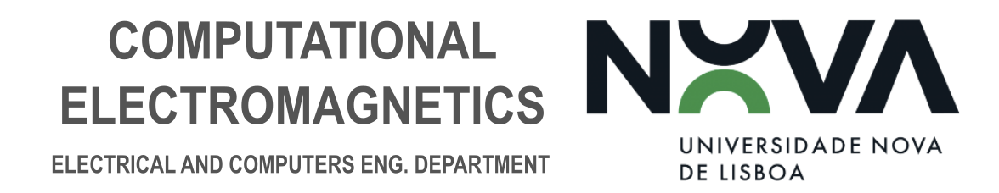

<p align="center">
    
</p>

<h1 align="center">Computational Electromagnetics Course Notebooks</h1>


<h2>Table of Contents</h2>
<ul>
	<li><a href="#overview">Overview</a></li>
	<li><a href="#dependencies">Dependencies</a></li>
	<li><a href="#downloading">Downloading</a></li>
	<li><a href="#contributing">Contributing</a></li>
	<li><a href="#licensing">Licensing</a></li>
	<!-- Add more practical classes as needed -->
</ul>

<h2 align="left" id="overview">Overview</h2>

<p>
This GitHub repository features a collection of <a href="https://jupyter.org/">Jupyter Notebooks</a> that used to study common and some advanced algorithms used in modern Computational Electromagnetics. The notebook examples are based on two primary books:
<ul>
<il>[1] Anders Bondeson, Thomas Rylander, and Par Ingelstroom's "Computational Electromagnetics", Springer, 2005 - featuring the core and common algorithms,</il>

<il>[2] M. V.K. Chari and S.J. Salon's "Numerical Methods in Electromagnetism" - A great mathematical complement to [1].</il>
</ul>
Three aditional support papers will be used to exemplify the usage of modern computer algorithms and machine learning to solve the problem of parasitic capacitance extraction - a problem that is very important to solve to ensure the reliability of any integrated circuit. <a href="https://python.org/">Python</a> is an open-source scripting language, and a much more powerful programming language than Octave - due to its greater user community, it is also much more versatile. As such, the course's practical notes were converted and adapted to Python. Using Python and Jupyter Notebooks also enables two very useful features: 
<ul>
	<li>The possibility of adding HTML and <a href="https://www.markdownguide.org/">Markdown</a> notes in the middle of code - providing a powerful note-taking system;</li>
	<li>The possibility of running computationally-heavy simulations in the cloud using <a href="https://colab.research.google.com/">Google Colab</a>.</li>
</ul>

Checkout:
- <a href="Python and Jupyter for UBC Mathematics">Uni. of British Columbia (UBC) : Python and Jupyter for UBC Mathematics</a>
- <a href="https://docs.scipy.org/doc/scipy/index.html">SciPy</a>
- <a href="https://numpy.org/">NumPy</a>

- <a href="https://matplotlib.org/">Matplotlib</a>

- <a href=https://pythonnumericalmethods.studentorg.berkeley.edu/notebooks/Index.html>Python Numerical Methods</a>
- <a href=https://geometryprocessing.github.io/blackbox-computing-python>Geometry Processing and Visualization in Python</a>

webpages for more information on how to use Python and Jupyter Notebooks for scientific/mathematical computing and data visualization.

<h2 align="left" id="dependencies">Dependencies</h2>


<!--This project is written in Python programming language. <br>-->

[](https://www.python.org/)

The following open source packages are used in this project:
  <br>

* <a href="https://numpy.org/doc/"> NumPy</a> - general-purpose matrix and array-processing package
* <a href="https://scipy.org/">SciPy</a> - fast-fourier-transform (FFT) and other advanced numerical methods for integration, differentiation, interpolation, optimization, linear algebra, statistics, and more.
* <a href="https://matplotlib.org/stable/index.html"> Matplotlib</a> & <a href="https://seaborn.pydata.org/">Seaborn</a> - data visualization and general plotting

* <a href="https://shapely.readthedocs.io/en/stable/index.html#">Shapely</a> - Manipulation and analysis of geometric objects in the Cartesian plane.

* <a href="https://pygmsh.readthedocs.io/en/latest/">PyGmsh</a> - Python interface for the Gmsh scripting language, for the creation of 2D and 3D mesh geometries for Finite Element Method (FEM) and other applications.

<h2 align="left" id="downloading">Downloading</h2>

<p align="justify">You can download the zip file of this repository <a href="https://github.com/das-dias/signal-converters-notebooks/archive/refs/heads/master.zip">here</a>. Another alternative is to simply clone this repository to your current working directory using the following command:</p>

```bash
git clone https://github.com/das-dias/signal-converters-notebooks.git
```

or

```bash
gh repo clone das-dias/signal-converters-notebooks
```

<h2 align="left" id="contributing">Contributing</h2>

<p align="justify">
Feel free to clone this repository and use it to make oyur own notes, complement them and even expand the existing notes. If an issue or a bug/error is discovered within the shared code do not hesitate in contacting me through one of the following emails:
<ul>
	<li> das.dias@campus.fct.unl.pt (institutional)</li>
	<li> das.dias6@gmail.fct (personal)</li>
	<!-- Add more contributors as needed -->
</ul>

In the case of an issue, me or any other main contributor will open an <a href="https://github.com/das-dias/signal-converters-notebooks/issues">issue-tracking thread</a> for this repository for each of the bugs that are found. Any change that is made to the notes by people interested in collaborating should be done so by generating a new <a href="https://github.com/das-dias/signal-converters-notebooks/pulls">pull request</a> to update the existing notes. The changes will then be reviewed, discussed and approved if they're actually adding value to the notes or correctign existing issues.

</p>

<h3 align="left">Main Contributors</h3>
<ul>
	<li> (creator) Diogo André Dias (das.dias@campus.fct.unl.pt)</li>
	<!-- Add more contributors as needed -->
</ul>

<h2 align="left">Licensing</h2>
<p>This project is licensed under the MIT License - see the <a href="./LICENSE">LICENSE</a> file or go to <a href="">the website</a> to find more details.</p>
